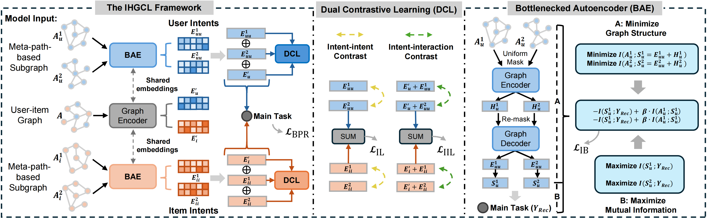

# IHGCL: Intent-guided Heterogeneous Graph Contrastive Learning for Recommendation
Lei Sang, Yu Wang, Yi Zhang, Yiwen Zhang* and Xindong Wu. 

 This is the PyTorch implementation by <a href='https://github.com/wangyu0627'>@WangYu</a> for IHGCL model proposed in this [paper]([https://arxiv.org/abs/2310.15950](https://arxiv.org/abs/2407.17234])

We will organize the complete code and upload it after the paper is accepted for publication.

## Model Architecture


### Enviroments
- python==3.10
- pytorch==2.0
- cuda==118
- dgl==2.0
## How to Run the code
```
python main.py --dataset=amazon --device='cuda:0'
```
